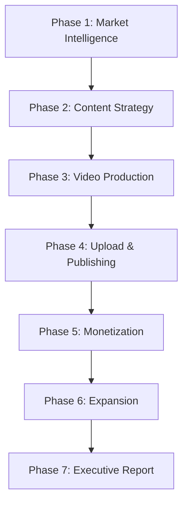

# YouTube Full Pipeline (Auto)

This master skill orchestrates the **entire YouTube Creator Suite** in a single automated pipeline. It chains all 10 specialized skills in the correct dependency order, passing outputs from earlier stages as inputs to later stages, producing a complete market-ready creator strategy from a single niche keyword.

---

## Required Inputs

| Input | Type | Required | Description |
| :--- | :--- | :--- | :--- |
| `niche` | string | **Yes** | Target vertical (e.g. `'ai automation'`, `'personal finance'`, `'home fitness'`). |
| `channel_handle` | string | No | Existing creator handle (e.g. `'@techcreator'`) to audit. Omit for new channel launches. |
| `competitor_handles` | list[string] | No | 2–5 rival channels to benchmark (e.g. `["@rival1", "@rival2"]`). |
| `target_languages` | list[string] | No | ISO 639-1 codes for international expansion (e.g. `["es", "pt", "de"]`). Default: `["es", "pt"]`. |
| `timezone_offset_hours` | integer | No | Creator timezone offset from UTC (e.g. `-5` for EST). Default: `0`. |

---

## Pipeline Execution Order

The pipeline executes in 7 phases. Each phase feeds data into subsequent phases.



---

### Phase 1: Market Intelligence & Competitive Reconnaissance
**Skills activated**: `competitor-intelligence`, `breakout-creator-scout`

#### Step 1.1 — Reverse-Engineer Competitor Channels
If `competitor_handles` are provided:
```
Call compare_channels(channel_identifiers=competitor_handles)
```
- Benchmark engagement rates, upload frequency, view-to-subscriber ratios.
- Identify the category leader and the fastest-growing underdog.

If `channel_handle` is provided (existing channel audit):
```
Call audit_channel_strategy(channel_id_or_handle=channel_handle)
Call find_viral_outliers(channel_id_or_handle=channel_handle, outlier_threshold=2.0)
Call analyze_shorts_to_longform_ratio(channel_id_or_handle=channel_handle)
Call analyze_audience_sentiment(video_id=<top_video_from_outliers>)
```

#### Step 1.2 — Scout Breakout Micro-Influencers
```
Call scout_niche_channels(niches=[niche], min_subscribers=2000, max_subscribers=50000, min_videos=5)
Call find_breakout_growth_channels(niche=niche, max_channel_age_months=12, min_subscriber_count=2000)
```
- Build the emerging creator watchlist with velocity scores.

#### Step 1.3 — Discover Active Brand Sponsors
```
Call discover_niche_sponsors(niche_keyword=niche, max_videos_to_scan=20)
```
- Catalog companies actively spending marketing budget in this vertical.

**Phase 1 Outputs** → Feed into Phase 2:
- Competitor vulnerability matrix
- Viral outlier topics list
- Active sponsor roster
- Audience sentiment & pain points

---

### Phase 2: Content Strategy & Ideation
**Skills activated**: `viral-video-ideation`, `channel-launch-architect`

#### Step 2.1 — Mine Content Gaps
```
Call find_content_gaps(niche_or_topic=niche)
```
- Identify outdated ranking videos (2+ years old) representing low-competition keyword opportunities.

#### Step 2.2 — Classify Traffic Potential
For each content gap discovered:
```
Call classify_traffic_potential(topic_or_title=<gap_title>)
```
- Tag each concept as **Evergreen Search** (steady multi-year utility) or **Algorithmic Browse** (fast velocity spike).

#### Step 2.3 — Design the 5-Video Binge Playlist Architecture
```
Call blueprint_new_channel(niche=niche)
Call design_binge_playlist(core_topic=niche, video_count=5)
```
- Structure the serialized video roadmap (Foundation → Implementation → Optimization → Mistakes → Capstone).
- Attach cliffhanger bridge scripts and end-screen card pointers.

**Phase 2 Outputs** → Feed into Phase 3:
- Ranked content gap opportunities
- Traffic classification per concept
- 5-video binge playlist roadmap

---

### Phase 3: Video Production & Packaging
**Skills activated**: `viral-video-ideation` (continued), `channel-growth-audit`

#### Step 3.1 — Simulate Title CTR & Select Winners
For each video in the binge playlist:
```
Call simulate_title_ctr(candidate_titles=[title_a, title_b, title_c], niche_context=niche)
```
- Grade candidates against Curiosity Gap, Threat Avoidance, Specificity, Contrast, and Speed triggers.
- Select the winner (target: CTR score > 80/100).

#### Step 3.2 — Generate Counter-Positioning Thumbnails
For each winning title:
```
Call generate_thumbnail_concepts(video_title=<winning_title>, niche_context=niche)
```
- Produce 3 contrasting visual concepts with Midjourney/DALL-E prompts.
- Review live competitor thumbnails to ensure visual differentiation.

#### Step 3.3 — Script Retention-Optimized Outlines
For each video:
```
Call generate_retention_script_outline(
    video_title_or_topic=<winning_title>,
    target_duration_minutes=10
)
```
- Auto-discovers the #1 ranking competitor, transcribes their hook, and mines viewer comments for objections.
- Generates the 7-beat retention script (Hook → Stakes → Step-by-Step → Cliffhanger Bridge).

#### Step 3.4 — Predict Pacing Dropoffs
For drafted scripts:
```
Call predict_retention_dropoffs(script_or_transcript=<draft_script>)
```
- Flag monotone explaining stretches (>45 seconds without pattern interrupts).
- Inject timestamped retention resets.

**Phase 3 Outputs** → Feed into Phase 4:
- 5 validated titles (CTR > 80)
- 15 thumbnail concepts with AI generation prompts
- 5 retention-optimized script outlines
- Pacing hazard reports

---

### Phase 4: Upload Metadata & Publishing Schedule
**Skills activated**: `algorithmic-publishing-scheduler`

#### Step 4.1 — Build Complete SEO Upload Packs
For each video:
```
Call generate_seo_metadata_pack(
    video_topic_or_working_title=<winning_title>,
    target_audience=<audience_from_phase_1>
)
```
- Produces: 3 mobile-optimized titles, search-optimized description, timestamped chapters, high-traffic tags, pinned comment.

#### Step 4.2 — Analyze Competitor Publishing Heatmap
```
Call analyze_optimal_upload_time(
    niche_or_channel=niche,
    sample_size=30,
    timezone_offset_hours=timezone_offset_hours
)
```
- Discover the "Sweet Spot" publishing window (low competition, pre-peak audience browsing).

#### Step 4.3 — Build the 30-Day Master Calendar
Assemble the editorial calendar:
- **Weekly Cadence**: 1 Long-Form + 2 Supporting Shorts + 2 Community Tab touchpoints.
- **Unlisted Buffer**: Upload 3 hours before scheduled public release for 4K processing and Content ID scanning.

**Phase 4 Outputs** → Feed into Phase 5:
- 5 complete SEO upload packs
- Optimal day/hour publishing windows
- 30-day master editorial calendar

---

### Phase 5: Monetization Architecture
**Skills activated**: `sponsor-pitch-architect`, `channel-launch-architect` (continued)

#### Step 5.1 — Install the 3-Tier Monetization Funnel
```
Call generate_monetization_offers(niche=niche, target_audience=<audience>)
```
- **Tier 1 (Free)**: Lead magnet cheatsheet/template → email list.
- **Tier 2 ($19–$47)**: Digital starter toolkit for immediate revenue.
- **Tier 3 ($250–$1,000+)**: 1-on-1 strategy consulting / implementation.

#### Step 5.2 — Generate Sponsor Rate Card & Cold Pitch
Using the active sponsor roster from Phase 1:
- Calculate data-backed CPM/flat-rate pricing for mid-roll and dedicated integrations.
- Draft personalized cold pitch emails for the top 3 verified niche sponsors.
- Design 2 creative organic integration angles per sponsor.

**Phase 5 Outputs** → Feed into Phase 6:
- Monetization funnel with description box template
- 3 sponsor pitch emails with rate cards

---

### Phase 6: Content Repurposing & International Expansion
**Skills activated**: `youtube-content-repurposing`, `international-arbitrage-expander`

#### Step 6.1 — Pre-Plan Repurposing Assets
For each video in the binge playlist:
```
Call analyze_community_posts(niche_or_channel=niche, target_goal="growth")
```
- Pre-generate Community Tab polls and quizzes to schedule 48 hours before and after each upload.
- Plan Shorts clip extraction (2 clips per long-form video).

#### Step 6.2 — Identify International Arbitrage Opportunities
```
Call find_cross_language_opportunities(
    topic_or_niche=niche,
    target_languages=target_languages
)
```
- Flag video concepts with Arbitrage Ratio > 5.0× (massive demand, zero native competition).
- Generate localized title/tag packs for Spanish, Portuguese, German, and French markets.
- Recommend Multi-Language Audio tracks vs. dedicated satellite channel deployment.

**Phase 6 Outputs** → Feed into Phase 7:
- Community Tab scheduling plan
- Shorts extraction plan
- International expansion strategy with localized metadata

---

### Phase 7: Executive Research Dossier
**Skills activated**: `executive-research-dossier`

#### Step 7.1 — Compile the Master Research Report
```
Call export_research_report(
    niche_or_topic=niche,
    competitor_channels=competitor_handles,
    format="markdown"
)
```
- Synthesize all prior phase outputs into a structured institutional-grade report.

#### Step 7.2 — Assemble the Final Deliverable
The complete pipeline output is organized into these sections:

1. **Executive Summary** — 3-bullet market thesis and opportunity sizing.
2. **Competitive Intelligence Matrix** — Head-to-head rival benchmarks, vulnerability analysis, and active sponsor discovery.
3. **Breakout Creator Watchlist** — Emerging high-velocity micro-influencers in the niche.
4. **Content Strategy** — 5-video binge playlist with validated titles (CTR > 80), thumbnail concepts, and traffic classifications.
5. **Production Pack** — 5 retention-optimized script outlines with pacing hazard reports.
6. **Upload & SEO Pack** — 5 complete metadata upload bundles with publishing schedule.
7. **Monetization Architecture** — 3-tier funnel design, sponsor rate cards, and cold pitch emails.
8. **Content Repurposing Plan** — Shorts extraction map and Community Tab scheduling calendar.
9. **International Expansion** — Cross-language arbitrage opportunities with localized metadata.
10. **90-Day Execution Roadmap** — Week-by-week implementation milestones.

---

## Quick Start

To execute the full pipeline with minimal inputs:

> **User prompt**: *"Run the full YouTube pipeline for the niche 'ai automation'. My channel is @techcreator, competitors are @rival1 and @rival2. I'm in EST timezone."*

The agent will automatically execute all 7 phases in sequence, calling the appropriate MCP tools at each stage, and deliver the complete deliverable as a structured Markdown report.

---

## Verification Checklist (Auto-Validated at Each Phase)
- [ ] **Phase 1**: Competitor benchmarks populated with live YouTube Data API numbers.
- [ ] **Phase 2**: Content gaps identified with real outdated ranking videos.
- [ ] **Phase 3**: All titles scored > 80/100 CTR; thumbnails counter-positioned against live competitors.
- [ ] **Phase 4**: Publishing windows calculated in creator's local timezone.
- [ ] **Phase 5**: Monetization funnel installed; sponsor pitch emails under 175 words.
- [ ] **Phase 6**: International markets evaluated with Arbitrage Ratio > 5.0×.
- [ ] **Phase 7**: Executive dossier formatted with clean tables and actionable 90-day roadmap.
