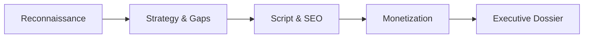

<div align="center">

# 🎬 YouTube MCP Server

### The Most Comprehensive YouTube Model Context Protocol (MCP) Server for AI Agents

**33 Tools · 11 Autonomous Agent Skills · Zero-Quota RSS Fallback · Multi-Key Pool · 101 Tests**

[](https://python.org)
[](https://modelcontextprotocol.io)
[](https://smithery.ai)
[](LICENSE)
[](tests/)
[](https://claude.ai)
[](https://cursor.com)

</div>

---

**YouTube MCP Server** connects your AI assistants — **Claude Desktop**, **Cursor**, **Windsurf**, **Antigravity**, and any MCP-compatible LLM agent — directly to live YouTube data. 

Unlike basic toy wrappers that only search videos, this is an **autonomous YouTube growth agency in a box**: reverse-engineer competitors, detect 3x+ viral outliers, extract transcripts without an API key, generate high-CTR thumbnail prompts, hunt paying brand sponsors, and execute complete 7-phase channel strategies.

---

## ⚡ 30-Second Quickstart

### 1. Claude Desktop (1-Click via Smithery)

```bash
npx -y @smithery/cli install youtube-mcp --client claude
```

Or manually add to your `claude_desktop_config.json`:
* **macOS**: `~/Library/Application Support/Claude/claude_desktop_config.json`
* **Windows**: `%APPDATA%\Claude\claude_desktop_config.json`

```json
{
  "mcpServers": {
    "youtube": {
      "command": "uvx",
      "args": ["youtube-mcp"],
      "env": {
        "YOUTUBE_API_KEY": "YOUR_GOOGLE_CLOUD_API_KEY"
      }
    }
  }
}
```

### 2. Cursor & Windsurf

Add to your workspace `.cursor/mcp.json` or global settings:

```json
{
  "mcpServers": {
    "youtube": {
      "command": "uvx",
      "args": ["youtube-mcp"],
      "env": {
        "YOUTUBE_API_KEY": "YOUR_GOOGLE_CLOUD_API_KEY"
      }
    }
  }
}
```

### 3. Direct Run via Terminal or Pip

```bash
# Instant run with uvx (no installation needed)
export YOUTUBE_API_KEY="your_key_here"
uvx youtube-mcp

# Or install via pip
pip install youtube-mcp
youtube-mcp
```

---

## 🌟 Why YouTube MCP Server?

| Feature | YouTube MCP Server | Standard YouTube Wrappers |
| :--- | :---: | :---: |
| **33 Specialized Creator Tools** | ✅ Full Suite | ❌ 2–3 basic endpoints |
| **Multi-Key Quota Rotation Pool** (`YOUTUBE_API_KEYS`) | ✅ Zero 403 Crashes | ❌ Hard quota failures |
| **Zero-Quota RSS Feed** (`get_channel_rss_videos`) | ✅ Free public Atom feed | ❌ Burns 100 quota units |
| **Transcript Extraction Without API Key** | ✅ Instant subtitles | ❌ Requires OAuth |
| **Viral Outlier Detection** (2.5x–10x spikes) | ✅ Built-in | ❌ None |
| **Sponsor Discovery & Rate Card Pricing** | ✅ Automated CPM cards | ❌ None |
| **11 Turnkey AI Agent Skills** | ✅ 7-phase autonomous pipeline | ❌ None |
| **Token-Optimized Markdown Payloads** | ✅ Designed for LLM context | ❌ Raw bloated JSON dumps |
| **Strict 100% Live Data Guarantee** | ✅ Authentic YouTube data only | ❌ Static/fake mocks |
| **Automated Test Coverage** | ✅ 101 Unit & Integration Tests | ❌ Untested |

---

## 🛠️ 33 Specialized Tools Directory

Every tool strips away raw JSON noise and returns structured, high-signal Markdown payloads optimized for LLM reasoning and minimal context usage.

### 1. 🔍 Search, Discovery & Scraping
| Tool | Quota Cost | Description |
| :--- | :---: | :--- |
| `search_videos` | 100 | Search YouTube with date filters, relevance, region codes, and duration. |
| `search_channels` | 100 | Discover niche channels enriched with subscriber counts and total views. |
| `scout_niche_channels` | Multi | Multi-niche creator scouting with subscriber range and activity filters. |
| `find_breakout_creators` | Multi | Uncover emerging creators (1k–50k subs) with 3x+ engagement velocity. |
| `get_trending_videos` | 1 | Fetch real-time trending videos by country and video category. |
| `get_channel_rss_videos` | **0 (Free)** | **Zero-Quota**: Pull recent channel uploads via public RSS with **no API key**. |

### 2. 📝 Video Intelligence & Transcripts
| Tool | Quota Cost | Description |
| :--- | :---: | :--- |
| `get_video_transcript` | **0 (Free)** | Extract video captions and transcripts. **Does not require an API key.** |
| `get_video_details` | 1 | Retrieve structured video stats, tags, descriptions, and duration. |
| `get_video_comments` | 1 | Pull top-level comments and discussions for viewer sentiment analysis. |
| `analyze_audience_sentiment` | 1 | Classify viewer comments into positive/negative sentiment, FAQs, and requests. |
| `extract_shorts_clips` | **0 (Free)** | Identify punchy 30–60 second viral clip segments from transcripts. |
| `generate_timestamped_chapters` | **0 (Free)** | Automatically generate YouTube description timestamps and chapter titles. |

### 3. 📊 Channel Analytics & Competitive Intelligence
| Tool | Quota Cost | Description |
| :--- | :---: | :--- |
| `get_channel_details` | 1 | Channel stats, subscriber count, branding, and uploads playlist ID. |
| `get_playlist_items` | 1 | List videos within any playlist or channel upload stream. |
| `audit_channel_strategy` | Multi | Full channel diagnosis: upload cadence, view consistency, and health score. |
| `find_viral_outliers` | Multi | Identify videos generating 2.5x–10x the channel's baseline view count. |
| `compare_channels` | Multi | Head-to-head benchmarking of 2–5 competing channels across all metrics. |
| `analyze_shorts_to_longform_ratio` | Multi | Measure how Shorts production impacts long-form subscriber conversion. |
| `analyze_publishing_cadence` | Multi | Generate upload frequency heatmaps and identify competitor gaps. |

### 4. 🎨 Content Strategy, Packaging & SEO
| Tool | Quota Cost | Description |
| :--- | :---: | :--- |
| `mine_content_gaps` | Multi | Find high-demand search topics where existing videos have low view counts. |
| `classify_traffic_potential` | Multi | Predict whether a topic will succeed primarily via Search or Browse/Suggested. |
| `generate_high_ctr_titles` | Multi | Craft 10 psychological title formulas (curiosity, fear of missing out, extremes). |
| `generate_thumbnail_concepts` | Multi | 3 counter-positioned thumbnail visual concepts with Midjourney/DALL-E prompts. |
| `script_retention_hook` | Multi | 7-beat retention script structure (0–30s hook, value bridge, payoff loop). |
| `build_seo_upload_pack` | Multi | Complete upload kit: CTR title, description, tags, and chapter markers. |
| `architect_binge_playlist` | Multi | Structure 5-video series playlists to maximize Session Watch Time. |
| `analyze_transcript_pacing` | **0 (Free)** | Calculate Words-Per-Minute (WPM) pacing to spot retention dropoff zones. |

### 5. 💰 Monetization, Sponsorships & Growth
| Tool | Quota Cost | Description |
| :--- | :---: | :--- |
| `discover_paying_sponsors` | Multi | Detect active brand sponsors in video descriptions across any niche. |
| `calculate_sponsor_rate_card` | Multi | Compute data-backed CPM and flat-rate sponsorship pricing. |
| `draft_sponsor_pitch_email` | Multi | Generate personalized brand outreach emails highlighting engagement metrics. |
| `design_monetization_funnel` | Multi | Build high-margin revenue funnels for channels under 1,000 subscribers. |
| `detect_international_arbitrage` | Multi | Find high-view English videos with zero competition in Spanish/Portuguese/German. |
| `generate_community_poll` | Multi | Create interactive Community Tab polls that drive algorithmic re-engagement. |

---

## 🤖 11 Turnkey Agent Skills (Autonomous Creator Agency)

The repository includes a ready-to-use **Antigravity Plugin** (`.agents/plugins/youtube-creator-suite/`) and 11 self-contained skills in `.agents/skills/`.

An AI agent can chain all tools into an end-to-end strategy automatically:



| Skill | Slash Command | What It Delivers |
| :--- | :--- | :--- |
| **Full Auto Pipeline** | `/youtube-full-pipeline` | 🔄 **End-to-End Orchestrator**: Chains all 10 skills in 7 automated phases from a single niche keyword. |
| **Channel Growth Audit** | `/channel-growth-audit` | Diagnoses channel health, retention, and viewer sentiment with a 90-day turnaround plan. |
| **Viral Video Ideation** | `/viral-video-ideation` | Content gap mining, title CTR psychological scoring, and Midjourney thumbnail prompts. |
| **Competitor Intelligence** | `/competitor-intelligence` | Benchmarks rival channels head-to-head and extracts active paying sponsors. |
| **Channel Launch Architect** | `/channel-launch-architect` | 0-to-1 launch blueprint: 5-video binge loops, 7-beat retention scripts, and upload packs. |
| **Content Repurposing** | `/youtube-content-repurposing` | Transcribes longform videos into timestamped chapters and viral Shorts clips. |
| **Sponsor Pitch Architect** | `/sponsor-pitch-architect` | Discovers niche sponsors, calculates CPM rate cards, and drafts cold pitch emails. |
| **Publishing Scheduler** | `/algorithmic-publishing-scheduler` | Analyzes competitor upload times to find low-competition Sweet Spot windows. |
| **International Arbitrage** | `/international-arbitrage-expander` | Uncovers zero-competition opportunities in non-English markets with localized tags. |
| **Breakout Creator Scout** | `/breakout-creator-scout` | Scouts micro-influencers (1k–50k subs) with 3x+ velocity for partnership rosters. |
| **Executive Dossier** | `/executive-research-dossier` | Compiles institutional-grade research dossiers formatted in Markdown or Notion. |

---

## 💡 Top Prompts to Try in Claude & Cursor

Once connected, simply ask your assistant in natural language:

* **Channel Turnaround**:
  > *"Audit @veritasium's channel. Identify their top viral outliers, analyze their upload cadence, and give me 3 video concepts to out-compete them."*
* **Viral Packaging**:
  > *"Find content gaps in the 'AI automation' niche. Generate 5 high-CTR title formulas and 3 counter-positioned thumbnail visual concepts with Midjourney prompts."*
* **Transcript Repurposing**:
  > *"Extract the transcript from this video URL https://youtu.be/... and write 3 high-hook YouTube Shorts scripts with visual cues."*
* **Sponsor Outreach**:
  > *"Find which brand sponsors are actively spending money in the 'productivity' niche, compute a rate card for a 50k subscriber channel, and write a pitch email."*
* **Complete Strategy**:
  > *"/youtube-full-pipeline niche='b2b saas growth' competitor_handles=['@saasstr', '@microconf']"*

---

## ⚙️ Environment Configuration

Create a `.env` file in your working directory (or set environment variables in your MCP client config):

```bash
# Required for YouTube Data API v3 queries
YOUTUBE_API_KEY="AIzaSy..."

# Optional: Multi-key quota failover pool (comma-separated)
YOUTUBE_API_KEYS="key_1,key_2,key_3"

# Optional: Server transport settings (stdio, sse, streamable-http)
MCP_TRANSPORT="stdio"
MCP_PORT=8000
MCP_HOST="127.0.0.1"

# Optional: Disk cache TTL in seconds (default: 3600)
MCP_CACHE_TTL=3600
```

> [!TIP]
> **No API Key?** Tools like `get_channel_rss_videos`, `get_video_transcript`, `extract_shorts_clips`, and `analyze_transcript_pacing` operate via public feeds and transcript streams with **zero API quota requirements**.

---

## 🐳 Docker Deployment (Remote SSE)

Run as an isolated, containerized remote MCP server:

```bash
# Build and run container
docker compose up -d

# Check health endpoint
curl http://localhost:8000/health
```

---

## 🤝 Contributing & Community

Contributions are welcome!
* 📖 Review [CONTRIBUTING.md](CONTRIBUTING.md) to set up your local development environment.
* 🧪 Run tests with `pytest` (101 automated tests ensuring zero regression).
* 🔒 See [SECURITY.md](SECURITY.md) for vulnerability reporting.
* 💡 [Open an Issue](https://github.com/mohamdben-yahia/youtube-mcp/issues) or join discussions to request new creator tools.

---

## 📄 License

MIT License — free for personal, commercial, and agency use.
